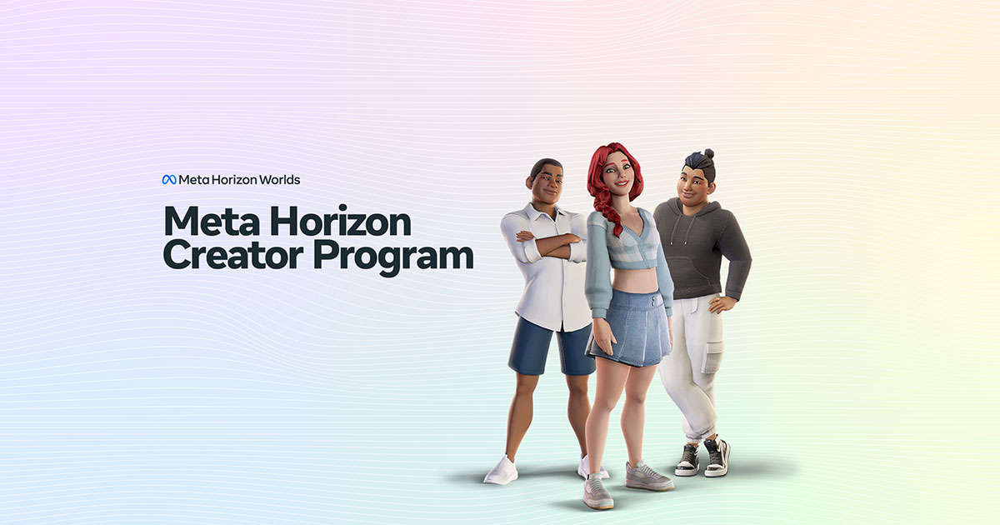

### **Getting Started with Gen AI**  

This guide will walk you through creating a simple scene using the Gen AI Creator Assitant and Style Reference Tools. This includes: 3D models, scripts, sounds, textures, ambient audio, sky domes, and environments

---

## Video Tutorial

Watch this comprehensive tutorial to see Gen AI in action:

*Click the image above to watch the Gen AI tutorial on YouTube*

<iframe width="560" height="315" src="https://www.youtube.com/embed/gaBi6tnIwQ0" title="YouTube video player" frameborder="0" allow="accelerometer; autoplay; clipboard-write; encrypted-media; gyroscope; picture-in-picture; web-share" referrerpolicy="strict-origin-when-cross-origin" allowfullscreen></iframe>

---

**Step 1: Create a 3D Model  ![][image1]**

1. Click the **Gen AI** tab at the top of your screen.  
2. Select the **3D models** icon.  
3. In the prompt field, enter "A Cowboy Riding a Horse."  
4. Click **Generate**.  
5. Choose the model you like best and click the **Texture This Model** button.  
6. Find your new textured model in the **Gen AI Assets** section of your assets panel.  
7. Drag the model from the assets panel and place it onto your platform.

![][image2]

---

**Step 2: Add a Script Using the Assistant  ![][image3]**

1. Click the **Assistants** Icon.   
2. Type "I would like the cowboy to move forward" in the prompt field.  
3. Click **Generate** to create the code.  
4. Test the script to ensure the cowboy moves forward.

![][image4]

### **Step 3: Add Sound to the Horse  ![][image5]**

1. Select the Horse from the scene by clicking on it.  
2. Click the **Gen AI** tab.  
3. Click the **audio** icon.  
4. In the prompt field, type "Horse walking noise."  
5. Click **Generate**.  
6. Choose the sound you like best and click **Select**.

![][image6]

---

### **Step 4: Create Ambient Sound ![][image7]**

1. Click the **Gen AI** tab.  
2. Click the **audio** icon.  
3. In the prompt field, type "Western Town Ambience."  
4. Click **Generate**.  
5. Choose the sound you like best and click **Select**.

![][image8]

---

### **Step 5: Create a texture using Style Reference ![][image9]**

1. Right-click on the platform in your scene and click **Edit Object**.  
2. Click the **texture** field.  
3. Click **Gen AI**.  
4. Click the **Style Reference** icon to the right of the text prompt.  
5. In the Style Reference modal, click **Upload Style**.  
6. Upload your image.  
7. Click **Confirm**.  
8. In the text prompt, type "Wood."  
9. Click **Generate**.  
10. Choose the texture you like and click **Select**.

![][image10]

---

### **Step 6: Create a Sky  ![][image11]**

1. Find your lighting source in the Inspector panel.  
2. Click the **Skybox** dropdown menu.  
3. Click **Gen AI**.  
4. In the prompt field, type "Desert sunset sky."  
5. Click **Generate**.  
6. Choose the sky you like and click **Select**.

![][image12]

![][image13]

**Your scene is complete!** You've successfully created a scene using Gen AI tools including a 3D model, scripts, sounds, textures, and a sky. These tools help streamline the creative process and bring your vision to life quickly and efficiently.

---

**Additional Resources:**

- Explore more Gen AI features in the **Gen AI** tab
- Experiment with different prompts to create unique assets
- Use Style Reference for consistent visual themes
- Combine multiple Gen AI assets to create complex scenes

[image1]: <data:image/png;base64,iVBORw0KGgoAAAANSUhEUgAAACoAAAAZCAIAAADITysPAAAC1UlEQVR4XsWVz2sTQRTHmzaCtUhPgjcRVCh48yBIT/oHqAdvPVSy2dBWwRoQRVAr/qyIRQtqW3uQUiqlFbUoaQ+pYKWltqaNJm2T3ewm2SS7zW6Tzf64Obtdgr7Jj82lPj6H/c68mTfv7bzdhgaC+Z9AvctAbZtGgmnvZQ93wfH6gNo2gxOJHVn7uSE5Lm7hs3aB2h5tl2mWV/SiTS1ITW7oYBeo7bGykTVjI8vlVe9AEvexBdQ2GP2UNgP...[trimmed for brevity]...>